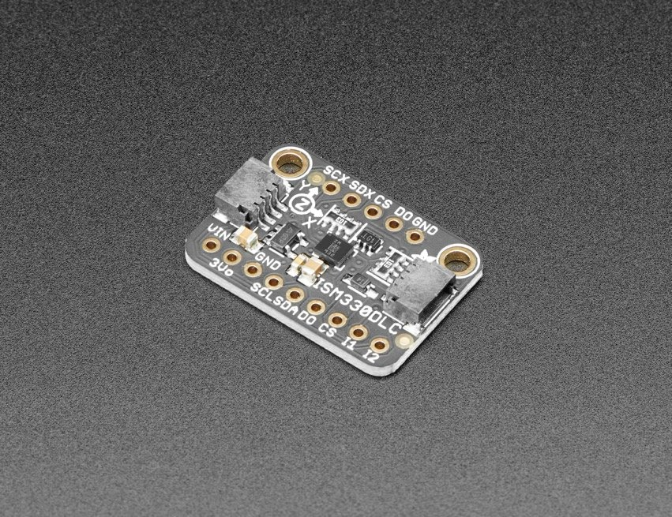

# Raspberry Pi ISM330DL Example

This repository contains a short example script that tests out the ISM330DLC iNEMO inertial module: 3D accelerometer and 3D gyroscope with digital output using my own Raspberry Pi [I2C library](https://github.com/besp9510/pi_i2c). This test includes setting up the device and reading magnetic field data.



This example requires the following dependencies (projects authored by me):
* [pi_lw_gpio.c](https://github.com/besp9510/pi_lw_gpio)
    * "Lightweight GPIO Interface Library for the Raspberry Pi"
* [pi_microsleep_hard.c](https://github.com/besp9510/pi_microsleep_hard)
    * "Hard Microsleep Library Via System Timer for the Raspberry Pi"
* [pi_i2c.c](https://github.com/besp9510/pi_i2c)
    * "Inter-Integrated Circuit (I2C) Library for the Raspberry Pi"

## Getting Started

These instructions will get you a copy of the project up and running on your local machine for development and testing purposes.

### Installing

#### Obtain the Project

First, clone this repository.

```
$ git clone https://github.com/besp9510/pi_ism330dlc_example.git
```

Alternatively, download the repository from Git.

#### Make

Compile test_lis3mdl.c into an executable.

```
$ make
```

## Running the Test

test_lis3mdl.c is a test script to check and see the I2C library working on your Pi with a ISM330DLC device. The outline of the test is:
1. Configure I2C library
2. Scan for the device
3. Verify device I.D.
4. Configure device
    * Set output data rate and sensitivity
5. Select operating mode
6. Read accelerometer and gyroscope data in a loop
7. Write data to a CSV file

## Contributing
Follow the "fork-and-pull" Git workflow.
1. Fork the repo on GitHub
2. Clone the project to your own machine
3. Commit changes to your own branch
4. Push your work back up to your fork
5. Submit a Pull request so that your changes can be reviewed

Be sure to merge the latest from "upstream" before making a pull request!

Feel free to email at the email address under my account name if you have any questions.
## Authors

Benjamin Spencer

## License

This project is licensed under the MIT License - see the [LICENSE.md](LICENSE.md) file for details